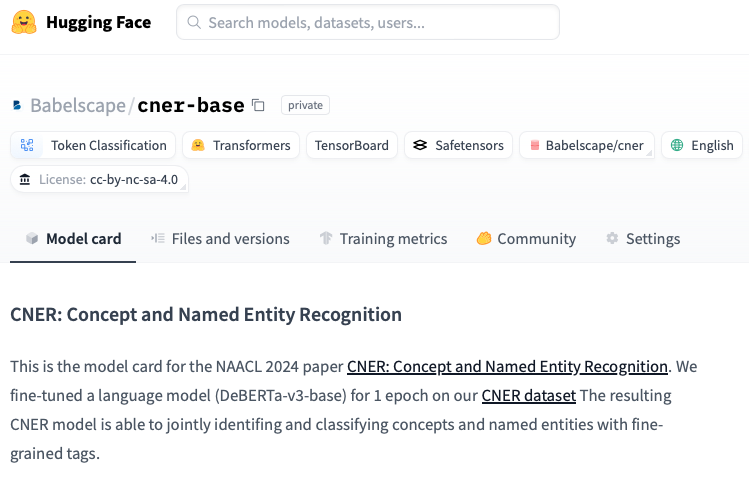
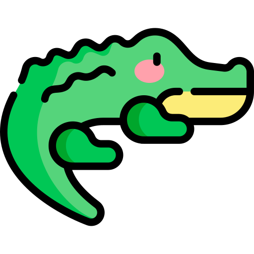
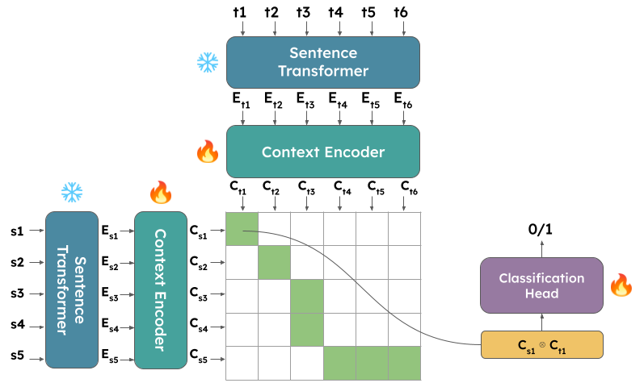

   <h1>Hi there, I'm Francesco Molfese! 👋 </h1>   

- Ph.D. Student @ [SapienzaNLP](http://sapienzanlp.uniroma1.it)
- Previously: NLP Engineer @ [Babelscape](https://babelscape.com)

### Contacts

 

<be>

### Recent Projects

<table width="100%">
<tc>

<td align="center">
<strong>&nbsp;CNER: Concept and Named Entity Recognition</strong>
 

</td>

<td align="center">
<strong>&nbsp; CroCoAlign: A Cross-Lingual, Context-Aware and Fully-Neural Sentence Alignment System for Long Texts</strong>
 

</td>

</table>

<be>

